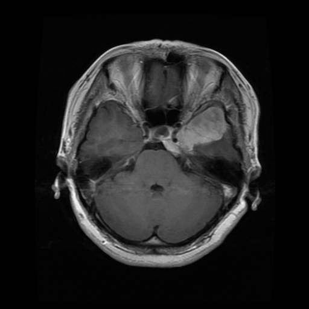
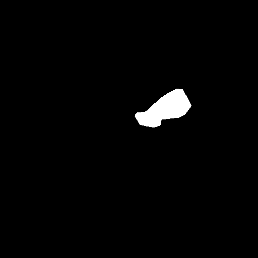

# Brain Segmentation with U-Net (PyTorch)

A PyTorch project for binary brain tumor segmentation using a custom U-Net model.

The notebook trains a segmentation model on paired MRI images and tumor masks, supports reading the dataset from Amazon S3, and visualizes both ground-truth and predicted masks.

## Features

- Custom U-Net implementation in PyTorch
- Binary segmentation of brain tumor regions
- Dataset loader that supports:
  - local folders
  - Amazon S3 buckets/prefixes
- Image/mask preprocessing with `torchvision.transforms.v2`
- Combined loss:
  - `BCEWithLogitsLoss`
  - custom `SoftDiceLoss`
- Validation with Dice score
- Visualization of:
  - input image
  - ground-truth mask
  - predicted mask
  - overlay

## Project structure

A typical dataset layout is:

```text
brain_tumor_segmentation/
  raw/
    images/
      1.png
      2.png
      ...
    masks/
      1.png
      2.png
      ...
```

Example images for the repo can be shown like this:

| Image | Mask |
|---|---|
|  |  |

## Data loading

The notebook uses a `BrainSegmentation` dataset class that can read either from:

- a local `path`
- or an S3 `bucket` + `prefix`

### Local usage

```python
from torchvision.transforms import v2 as tfs_v2
from torchvision.transforms.v2 import InterpolationMode
import torch

tr_img = tfs_v2.Compose([
    tfs_v2.Resize((256, 256), interpolation=InterpolationMode.BILINEAR),
    tfs_v2.ToImage(),
    tfs_v2.ToDtype(torch.float32, scale=True)
])

tr_mask = tfs_v2.Compose([
    tfs_v2.Resize((256, 256), interpolation=InterpolationMode.NEAREST),
    tfs_v2.ToImage(),
    tfs_v2.ToDtype(torch.float32),
    tfs_v2.Lambda(lambda x: (x >= 128).long())
])

dataset = BrainSegmentation(
    path="./brain_tumor_segmentation/raw",
    transform_img=tr_img,
    transform_mask=tr_mask,
)
```

### S3 usage

```python
dataset = BrainSegmentation(
    bucket="brain-data-bucket",
    prefix="brain_tumor_segmentation/raw",
    transform_img=tr_img,
    transform_mask=tr_mask,
)
```

### S3 permissions

If running in SageMaker, your execution role needs access to:

- `s3:ListBucket` on the bucket
- `s3:GetObject` on the dataset prefix

Example object path:

```text
s3://brain-data-bucket/brain_tumor_segmentation/raw/images/1.png
```

## Preprocessing

The notebook applies these transformations:

### Images

- resize to `256 x 256`
- bilinear interpolation
- convert to tensor/image format
- cast to `float32`
- scale to `[0, 1]`

### Masks

- resize to `256 x 256`
- nearest-neighbor interpolation
- convert to tensor/image format
- cast to `float32`
- threshold into a binary mask using:

```python
lambda x: (x >= 128).long()
```

## Model

The model is a custom U-Net with:

- encoder blocks
- decoder blocks
- skip connections
- convolution + ReLU + batch normalization stacks

This architecture is designed for dense pixel-wise segmentation.

## Training setup

The notebook uses:

- **optimizer:** `Adam`
- **learning rate:** `0.001`
- **weight decay:** `0.0001`
- **loss:**
  - `BCEWithLogitsLoss`
  - `SoftDiceLoss`
- **validation metric:** Dice score
- **train/validation split:** 80 / 20
- **batch size:** 2

Checkpointing saves the best model to:

```text
best_model.tar
```

## Visualization

The notebook visualizes:

- raw input image
- ground-truth mask
- predicted mask
- optional overlay for qualitative comparison

## Running in SageMaker

A practical workflow in SageMaker is:

1. Upload data to S3
2. Grant SageMaker execution role access to the bucket/prefix
3. Load the dataset from S3 or sync it locally
4. Train on a GPU instance for faster iteration

For better performance than reading one object from S3 at a time, sync the dataset locally first:

```bash
aws s3 sync s3://brain-data-bucket/brain_tumor_segmentation/raw /home/sagemaker-user/brain_data/raw
```

Then use:

```python
dataset = BrainSegmentation(
    path="/home/sagemaker-user/brain_data/raw",
    transform_img=tr_img,
    transform_mask=tr_mask,
)
```

## Dependencies

The notebook uses:

- Python
- PyTorch
- torchvision
- Pillow
- NumPy
- matplotlib
- boto3

## Notes

- This project currently performs **binary segmentation**.
- Masks are thresholded into tumor vs. non-tumor classes.
- For serious experimentation, consider:
  - more epochs
  - data augmentation
  - larger batch size if memory allows
  - mixed precision training
  - local caching or SageMaker File/FastFile data access

## Future improvements

- add metrics logging per epoch
- save training curves
- support multiclass segmentation
- use a more standard medical imaging dataset split
- add inference script for single images
- package training into a standalone Python module instead of notebook-only workflow
